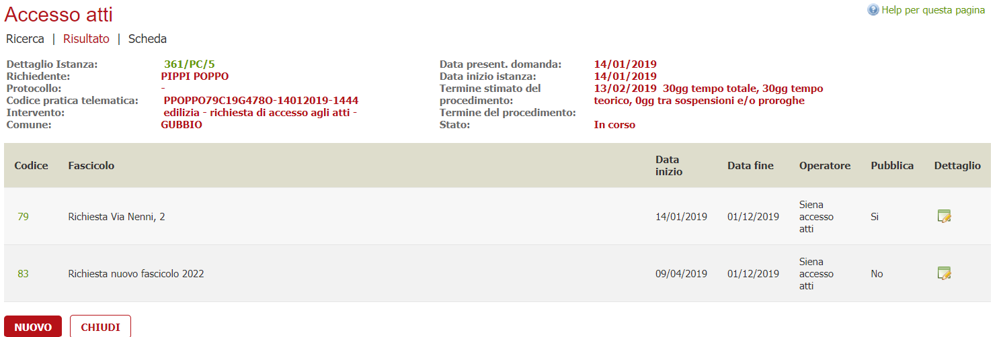
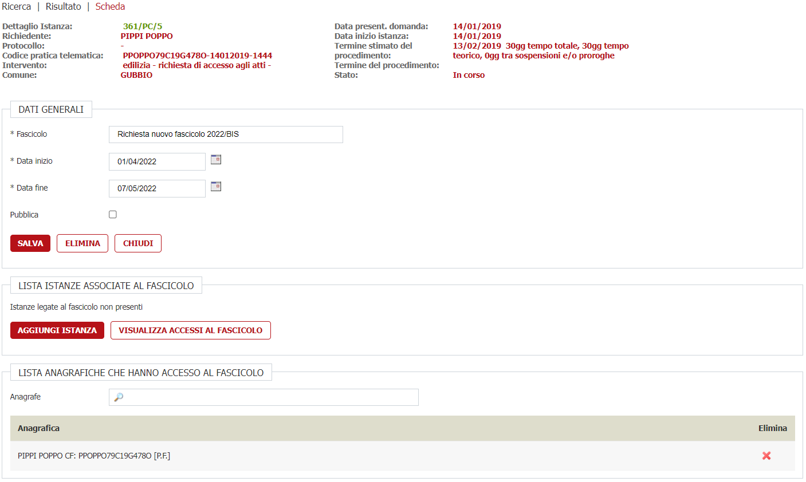
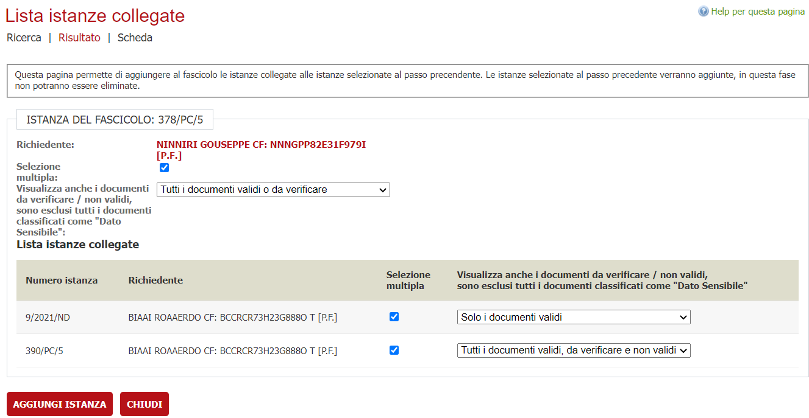
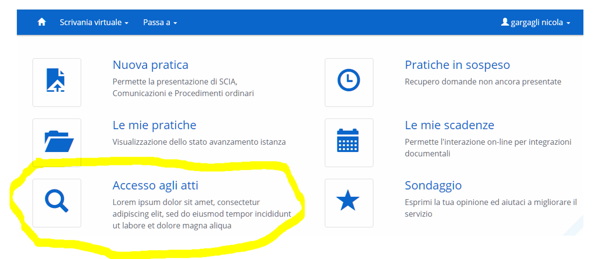

# Accesso agli atti

La funzionalità permette di creare un fascicolo di istanze che può essere visionato sul frontoffice dalle anagrafiche che possono accedere al portale. Le anagrafiche che potranno accedere al fascicolo saranno configurate nel backoffice; il fascicolo sarà visionabile per un determinato intervallo di tempo, sempre configurabile nel backoffice.

## Attivare la funzionalità

La funzionalità può essere attivata per singola voce dell'albero dei procedimenti; nella sezione "Area riservata" è stato aggiunto un nuovo checkbox "Accesso Atti"

Se selezionato all'interno dell'elaborazione di un'istanza comparirà un nuovo bottone "Configura accessi atti" che permetterà di creare un fascicolo visionabile sul frontoffice.

## Creazione e Configurazione fascicolo

Entrando in elaborazione di una istanza associata ad una voce dell'albero configurata per creare un fascicolo comparirà un nuovo bottone "Configura accesso atti"

Cliccando sul bottone si aprirà una nuova scheda in cui è presente una tabella con un elenco dei fascicoli creati.

Nella tabella saranno indicati la data di inizio e fine del procedimento, l'operatore che lo ha creato, la colonna "Pubblica" che indica se il fascicolo verrà reso pubblico o meno. L'icona nella colonna "Dettaglio" l'icona presente permetterà di entrare nella configurazione del fascicolo. Il bottone Nuovo permetterà di creare un nuovo fascicolo.

### Creazione fascicolo

Cliccando su nuovo avremo un form che ci permetterà di inserire le seguenti informazioni:

1. Data inizio
2. Data fine
3. Se pubblicare o no il fascicolo

Cliccando su "inserisci" verrà creato un nuovo fascicolo, inizialmente vuoto che contiene due tabelle:

1. Lista delle istanze presenti nel fascicolo
2. Lista delle anagrafiche che possono accedere al fascicolo

### Aggiungere un'anagrafica

Per aggiungere un'anagrafica che può accedere al fascicolo basta effettuare la ricerca nell'apposito campo (vedi immagine),

alla scelta dell'anagrafica automaticamente questa verrà aggiunta alla tabella (evidenziata in verde). La [X] permetterà di eliminare questa associazione.

Nel caso si tenti di aggiungere un'anagrafica già presente, il sistema evidenzierà la situazione tramite un messaggio e l'anagrafica non sarà duplicata nella lista (vedi immagine)

### Aggiungere un'istanza al fascicolo

Cliccando sul bottone "Aggiungi istanza" sarà possibile collegare al fascicolo altre istanze presenti nel sistema

All'aggiunta di un'istanza potranno accadere due casi:

1. Le istanze scelte non hanno istanze collegate
2. Le istanze scelte hanno istanze collegate

Cliccando sul bottone "Aggiungi istanza" si accede alla classica pagina della ricerca istanze, effettuata la ricerca secondo i filtri impostati accederemo ad una pagina che riporterà una lista di istanze

Attraverso il checkbox "selezione multipla" possiamo decidere quali istanze collegare al fascicolo; è possibile decidere per ogni istanza, se mostrare anche i documenti non validi/da verificare o tutti.

Sono disponibili le seguenti opzioni:

- Solo i documenti validi

- Tutti i documenti validi o da verificare

- Tutti i documenti validi, da verificare e non validi

In ogni caso saranno esclusi dalla visura tutti i documenti contrassegnati con **contenuto sensibile**

#### contrassegnare i documenti come Contenuto Dato Sensibile

In tutti i documenti viene presentata la possibilità di venire contrassegnato come **"contenuto con dato sensibile"**.

L'icona che permette di impostare questo attributo è quella definita dalla seguente immagine nel caso di lista dei documenti.

>

o nel caso del dettaglio di un documento dalla immagine che segue.

> 

Al click sull'icona viene chiesto di confermare l'operatore per modifcare l'attributo.

> 

### Caso 1: Le istanze scelte non hanno istanze collegate

Se selezioniamo tutte istanze che non hanno istanze collegate cliccando sul bottone "Collega istanza" il sistema assocerà le istanze scelte al fascicolo e tornerà sulla pagina principale evidenziando la riuscita dell'operazione con il messaggio "Inserimento eseguito" e popolando la tabella.

### Caso 2: Le istanze scelte hanno istanze collegate

Se tra le istanze selezionate è presente almeno una che ha istanze collegate cliccando sul bottone "Collega istanza" il sistema presenterà una pagina intermedia che permetterà all'operatore di decidere se associare al fascicolo anche le istanze collegate.

All'operatore verranno mostrate tutte le istanze collegate per ogni singola istanza scelta, anche qui sarà possibile effettuare una scelta multipla e se nel fascicolo dovranno essere mostrati anche i documenti non validi/da verificare.
In questa fase non potranno essere modificate le impostazioni delle istanze selezionate al passo precedente. Cliccando sul bottone "Collega istanza" il sistema assocerà le istanze scelte al fascicolo e tornerà sulla pagina principale evidenziando la riuscita dell'operazione con il messaggio "Inserimento eseguito" e popolando la tabella.

> NB: se proviamo ad inserire nella lista una pratica già esistente il sistema la scarta, per modificare la proprietà sulla visualizzazione dei documenti dobbiamo intervenire sul flag presente nella tabella delle istanze legate al fascicolo

Sulla lista delle istanze legate al fascicolo sarà possibile:

1. Eliminare l'associazione dell'istanza al fascicolo tramite l'icona [X]
2. Modificare l'accesso ai documenti

## Modifica fascicolo

Sarà possibile modificare il fascicolo entrando nel dettaglio e in particolare possiamo:

1. Modificare data inizio, data fine e pubblica tramite il bottone "Salva"
2. Aggiungere istanze al fascicolo (procedura descritta nel paragrafo "creazione fascicolo")
3. Eliminare istanze al fascicolo (procedura descritta nel paragrafo "creazione fascicolo")
4. Aggiungere anagrafiche al fascicolo (procedura descritta nel paragrafo "creazione fascicolo")
5. Eliminare anagrafiche al fascicolo (procedura descritta nel paragrafo "creazione fascicolo")

### Visualizza accessi al fascicolo

All'interno del dettaglio di un fascicolo sarà presente il bottone "Visualizza Accessi" che permetterà di visualizzare gli accessi fatti per ogni singola istanza dal frontoffice

Gli accessi saranno riportati su una tabella

Dove verranno indicati:

1. Anagrafica che ha acceduto
2. Istanza a cui ha acceduto
3. Data/ora di accesso
Le informazioni saranno solo in lettura e non potranno essere modificate/cancellate

### Estrazione dati

Sarà possibile interrogare il sistema per due criteri principali:

- dato un nominativo, conoscere a quali Pratiche Edilizie ha avuto accesso (e quando) e con quale pratica di accesso agli atti è stata effettuata (numero/anno/VIS)
- dato un numero di Pratica Edilizia, da chi e quando è stata visionata e con quale pratica di accesso agli atti è stata effettuata (numero/anno/VIS).

Per poter accedere a questa funzionalità bisognerà seguire il percorso "Statistiche->Pratiche Edilizie->Accesso agli atti", si aprirà allora una maschera di ricerca (vedi immagine)

Per poter effettuare la ricerca sarà sufficiente selezionare almeno un'anagrafica che ha acceduto alla pratica oppure un numero istanza.
Inoltre è possibile filtrare anche per un dato intervallo temporale impostando le date nel campo Periodo.

E' possibile ordinare la lista sia per "Nominativo" che per "Numero istanza", e in ordine crescente o descrescente.

La lista ottenuta si potrà esportare nei formati csv, xml o PDF selezionando le relative icone nella barra in alto alla tabella.

## Configurazione Area Riservata

### Menu.xml

Per attivare la funzionalità di accesso atti nell'area riservata occorre configurare il file menu.xml del relativo modulo software aggiungendo una nuova voce:

>        <MenuItem icona-bs="search">
>          <Titolo>Accesso agli atti</Titolo>
>          <Descrizione>Permette di accedere alle  richieste di accesso atti presentate mediante l'appositio servizio</Descrizione>
>          <Url>~/reserved/accesso-atti/accesso-atti-list.aspx</Url>
>        </MenuItem>

Questo attiverà un nuovo link nella home page dell'AR

Selezionando tale voce l'utente verrà portato ad una nuova pagina che presenta la lista delle istanze a cui egli ha accesso:

[accesso_atti_15](./immagini/accesso_atti_15.png)

Alla selezione di una delle voci presenti nella lista l'utente verrà portato nella relativa pagina di dettaglio:

## Personalizzazione della descrizione della pagina "Lista atti"

È possibile personalizzare il testo che compare nella pagina "Lista atti" in due modalità:

### Tramite gestione testi

Tramite la pagina di gestione dei testi selezionare la voce "AREA_RISERVATA.ctl00_ContentPlaceHolder1_descrizioneAccessoAtti".

### Tramite editing dall'interfaccia

Se l'utente che accede all'AR ha impostato il flag "utente tester" potrà editare il testo tramite l'interfaccia. Per fare ciò sarà sufficiente fare doppio click nella sezione che si intende modificare

Questo causerà l'apertura di una finestra pop-up in cui sarà possibile editare il testo della sezione a proprio piacimento

### Visualizzazione dei movimenti della pratica e dei relativi files

Versione minima: 2.104.

Di default durante l'accesso agli atti *non* vengono visualizzati i movimenti effettuati e i relativi files. Per abilitare tale funzionalità occorre impostare a 1 il parametro *AR_MOSTRA_DATI_MOVIMENTI* della verticalizzazione *ACCESSO_AGLI_ATTI*.
Nel caso il parametro sia impostato a 0 o non sia presente, la sezione "Movimenti" e relativi "Files" non saranno visualizzati.

I files dei movimenti verranno mostrati in base alle regole di visualizzazione impostate nel fascicolo.
