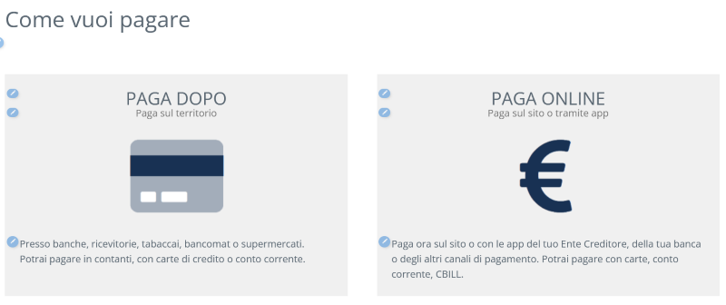
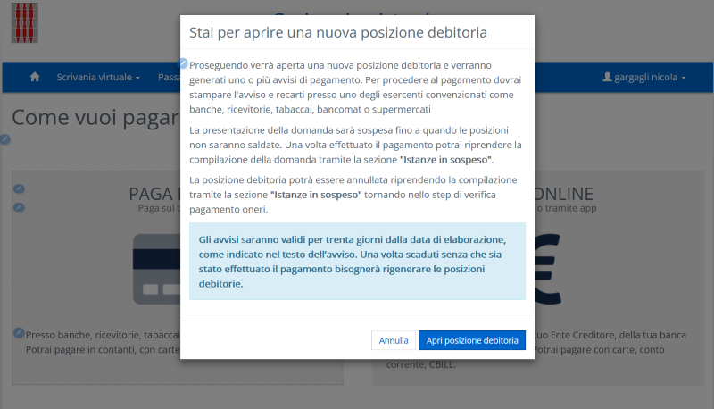
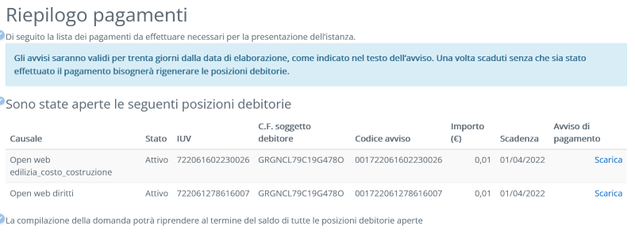

# Configurazione dei pagamenti tramite nodo pagamenti generico

Questa configurazione permette di attivare i pagamenti on line utilizzando il nodo di pagamenti generico di backend.

Gli steps che permettono di gestire il pagamento sono:

- ~/reserved/inserimentoistanza/pagamenti/VerificaStatoPagamentiNodoPagamenti.aspx
- ~/reserved/inserimentoistanza/pagamenti/GestionePagamentiNodoPagamenti.aspx
- ~/reserved/inserimentoistanza/pagamenti/PagamentoNodoPagamenti.aspx

Vedi la sezione [Configurazione dei pagamenti on line](../../README.md) per informazioni generali sui singoli step

## Properties degli step

### VerificaStatoPagamentiNodoPagamenti.aspx

- MessaggioErrore (1): Messaggio di errore da mostrare all'utente
- TestoBottoneProcedi (2): Testo del bottone che permette di annullare il pagamento e procedere

### GestionePagamentiNodoPagamenti.aspx

- VerificaFirmaDigitaleBollettino (1): Se true effettua la verifica della firma digitale della ricevuta attestante il pagamento degli oneri (solo per oneri dichiarati "già pagati")
- EtichettaColonnaEndoprocedimento (2E): Etichetta da utilizzare per la colonna "Endoprocedimento"
- EtichettaColonnaCausaleEndo (3E): Etichetta della colonna "Causale" per la tabella degli oneri endo
- EtichettaColonnaIntervento (2I): Etichetta da utilizzare per la colonna "Intervento"
- EtichettaColonnaCausaleIntervento (3I): Etichetta della colonna "Causale" per la tabella degli oneri intervento
- TitoloCaricamentoBollettino (4): Titolo del blocco caricamento bollettino
- DescrizioneCaricamentoBollettino (5): Testo interno della sezione di caricamento bollettino
- DescrizioneCaricamentoBollettinoEffettuato (6): Testo mostrato nel momento in cui il bollettino è stato caricato

- TestoDichiarazioneAssenzaOneri (7): Testo da mostrare nel box "Dichiaro di non avere oneri da pagare"

### PagamentoNodoPagamenti.aspx

Non ha parametri specifici

## Altre dipendenze

Dipende dalla verticalizzazione NODO_PAGAMENTI.

I parametri utilizzati sono:

- URL_WS: Url dei servizi del nodo pagamenti
- AR_COD_FISC_ENTE_CREDITORE: Codice fiscale ente creditore da utilizzare per l'area riservata
- AR_URL_BACK: Url a cui ritornare quando si annulla un pagamento o quando si fa click su "indietro nel sistema di pagamento"
- AR_URL_RITORNO: Url di ritorno al termie della procedura di pagamento
- ID_MODALITA_PAGAMENTO: fk su TIPIMODALITAPAGAMENTO, id della modalità di pagamento da impostare a pagamento completato

## "Paga dopo"

Se il connettore pagamenti è possibile attivare il pagamento differito.

Per attivare il pagamento differito occorre impostare a 1 il parametro **AR_ATTIVA_PAGO_DOPO** della verticalizzazione **NODO_PAGAMENTI**.
E'anche possibile configurare il parametro **AR_PAGO_DOPO_GG_SCADENZA** per impostare i giorni di scadenza della posizione debitoria 
(se non impostato verrà utilizzato il valore 30)

> Attenzione! Per poter utilizzare il "Paga dopo" è necessario che il connettore sia attivo e supporti la funzionalità "supportaInvioAvviso" 

### Steps paga dopo

Se il pago dopo è attivo allora l’utente potrà scegliere se pagare con modello 3 o modello 1. Nel caso non sia attivo rimarrà il comportamento corrente

Al click su “Paga dopo” verrà mostrato un messaggio di conferma in cui verrà spiegato che stanno per essere aperte delle posizioni debitorie e che non sarà possibile proseguire con la compilazione della domanda fino a quando le posizioni non verranno saldate

Una volta che le posizioni debitorie sono state aperte con successo all’utente verrà mostrata una schermata di riepilogo con i riferimenti utili per effettuare i pagamenti. Sempre dal riepilogo sarà possibile scaricare gli avvisi di pagamento utilizzabili per pagare presso tabaccai, poste, etc…

La presentazione della domanda sarà bloccata fino al completamento del pagamento di tutte le posizioni debitorie aperte. L’utente potrà in seguito annullare una o tutte le posizioni che non siano già state saldate e non potrà eliminare la pratica dalle istanze in sospeso

