# Commissioni e conferenze

Questo modulo consente la gestione completa delle Commissioni Edilizie, Commissioni per la Qualità Architettonica e Paesaggistica ( CQAP ),
Conferenze dei Servizi e altre tipologie di commissioni.
Consente di configurare commissioni sincrone e asincrone, definendone le pratiche da discutere, i partecipanti e le modalità di partecipazione e di espressione del parere.

## Pre-requisiti

- backend ( VBG ) alla versione 2.94 o successiva

## Backoffice

### Configurazione

Per poter gestire le commissioni è necessario configurare prima alcuni aspetti:

- Tipologie di commissioni
- Tipologie di pareri
- Cariche dei soggetti partecipanti

Tutte le configurazioni vengono fatte all'interno del backoffice nella sezione Archivi -> Archivi (modulo) -> Commissioni e conferenze
in cui è previsto un menù per ogni singola configurazione

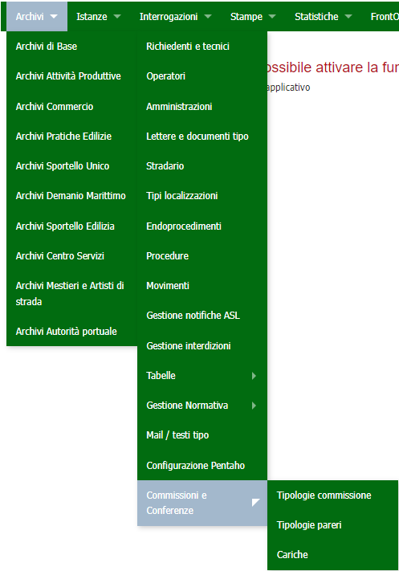

### Utenti delle amministrazioni

Per poter accedere alle commissioni da area riservata è necessario associare gli utenti della sezione richiedenti e tecnici alle amministrazioni abilitate a partecipare alla commissione.

È possibile far ciò mediante la funzione **UTENTI SCRIVANIA** presente nel dettaglio di una amministrazione.

### Configurazione Tipologie di commissioni

Dalla voce di menu Archivi -> Archivi (modulo) -> Commissioni e conferenze -> Tipologie commissioni vengono gestite tutte le tipologie di commissione
che sarà possibile svolgere ( CQAP, CTI, ... ).

Questo è un dato obbligatorio nelle commissioni per cui va definita almeno una tipologia

La prima parte mostra la lista delle tipologie configurate con la possibilità di modificarle, aggiungerne nuove o eliminarle; viene mostrato un campo di ricerca
a monte della tabella per poter filtrare i risultati

Le informazioni richieste nella configurazione ( nuova tipologia o modifica di una tipologia esistente ) sono le seguenti:

| Parametro                                   | Descrizione                                                                                                                                                               |
| ------------------------------------------- | ------------------------------------------------------------------------------------------------------------------------------------------------------------------------- |
| Descrizione                                 | Nome della tipologia che viene mostrata nelle commissioni per scegliere la tipologia da assegnare alla commissione                                                        |
| Disabilitato                                | Spuntando questa opzione, non sarà più possibile utilizzare la tipologia nelle nuove commissioni                                                                          |
| Numero progressivo                          | Permette di assegnare una numerazione automatica alle commissioni; se vuoto bisognerà indicare manulmente il numero della commissione                                     |
| Amministrazione                             | Identifica l'amministrazione con cui verrà fatto il movimento di rilascio parere nelle pratiche discusse in commissione                                                   |
| Caricamento di un file firmato obbligatorio | Nelle commissioni asincrone, obbliga i partecipanti a caricare un file firmato digitalmente quando indicano il loro parere                                                |
| Movimenti di richiesta                      | Indica i movimenti che dovranno essere presenti nelle istanze per permetterne l'associazione a quelle tipologie di commissioni. E' possibile indicare uno o più movimenti |

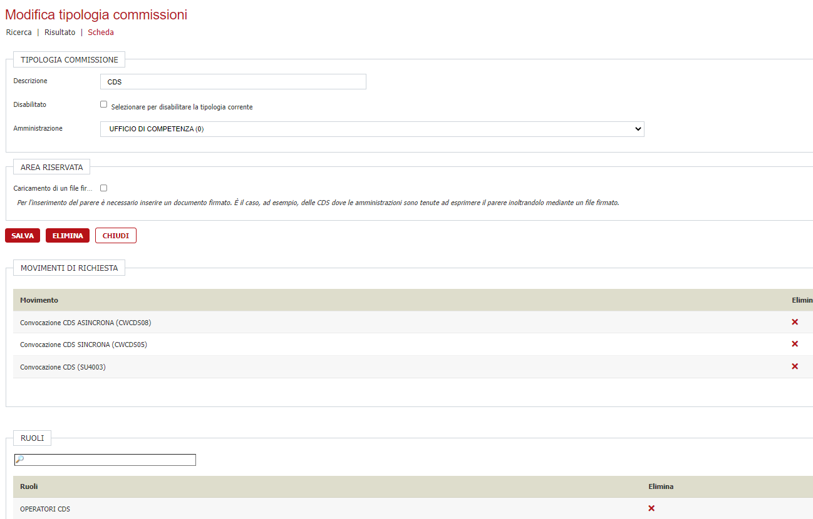

### Configurazione Tipologie di pareri

In questa sezione vengono configurati tutti i possibili pareri che potranno essere espressi in fase di discussione delle pratiche in commissione e,
per ognuno, viene configurato il movimento che verrà fatto automaticamente nelle istanze discusse ( utile in quanto a fronte di un determinato
parere espresso, la pratica prevede un iter al posto di un altro )

La prima pagina mostrata riporta l'elenco delle tipologie di pareri configurati permettendone la modifica o l'aggiunta di nuove tipologie

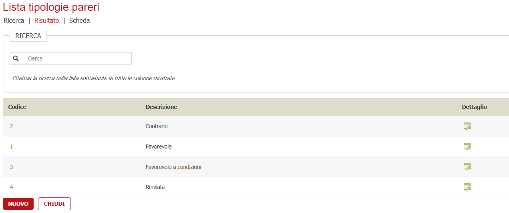

Le informazioni richieste in fase di configurazione ( nuova tipologia di parere o modifica di una tipologia esistente ) sono le seguenti:

| Parametro      | Descrizione                                                                                                                                                                                                                                                                                               |
| -------------- | --------------------------------------------------------------------------------------------------------------------------------------------------------------------------------------------------------------------------------------------------------------------------------------------------------- |
| Descrizione    | Nome della tipologia che viene mostrata in fase di assegnazione parere alla pratica discussa                                                                                                                                                                                                              |
| Tipo movimento | Movimento che verrà fatto in automatico dal sistema una volta espresso il parere                                                                                                                                                                                                                          |
| Esito          | Positivo / Negativo è l'esito che verrà assegnato al movimento sopra specificato. Ad esempio possiamo avere il parere "FAVOREVOLE" che effettua il movimento "Rientro parere da commissione edilizia" con esito favorevole e il parere "CONTRARIO" che effettua lo stesso movimento ma con esito negativo |

### Configurazione Cariche

In queta sezione vengono definite le cariche dei partecipanti alla commissione ( presidente, segretario, commissario, ... ) e per ogni carica definita
viene indicato se ha diritto al voto ppure no ( ad esempio il segretario partecipa alla commissione ma non ha diritto al voto )

La prima parte riporta l'elenco delle cariche configurate permettendone la modifica e l'aggiunta di nuove cariche. Nella lista compare anche la colonna
ordine utilizzata, in fase di commissione per proporre le cariche in un ordine diverso da quello alfabetico

Le informazioni richieste in fase di configurazione ( nuova carica o modifica di una carica esistente ) sono le seguenti:

| Parametro       | Descrizione                                                                                                                  |
| --------------- | ---------------------------------------------------------------------------------------------------------------------------- |
| Descrizione     | Nome della carica che comparirà in fase di appello iniziale della commissione                                                |
| Diritto al voto | Spuntare se la carica permette di esprimere un voto in fase di discussione pratiche; in caso contrario lasciare non spuntato |
| Ordinamento     | Accetta valori numerici e permette di ordinare le cariche secondo un ordine diverso da quello alfabetico                     |

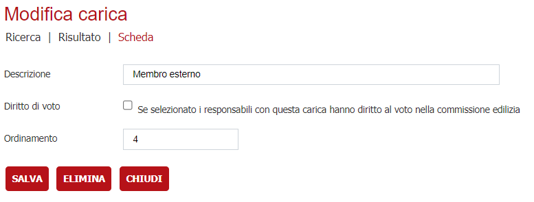

### Nuova commissione

Terminata la parte precedente di configurazione, si passa alla pianificazione della commissione. A prescindere dalla modalità di svolgimento, sincrona
o asincrona, la pianificazione della commissione e delle sue fasi è identica e viene fatta dalla voce di menu Istanze -> ( modulo ) -> Commissioni e Conferemze

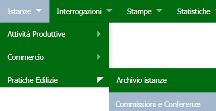

Dalla lista che compare cliccare il bottone NUOVO che compare in fondo, per procedere con la pianificazione di una nuova commissione

In questa fase l'operatore immettere i campi obbligatori

### Dettaglio della commissione

Un volta creata la commissione ne dovranno venire definite le proprietà:

- le convocazioni con data e orari
- i convocati ovvero chi parteciperà alla commissione conferenza mediante la funzionalità **appello iniziale**
- le pratiche che verranno discusse mediante la funzionalità **dettaglio**

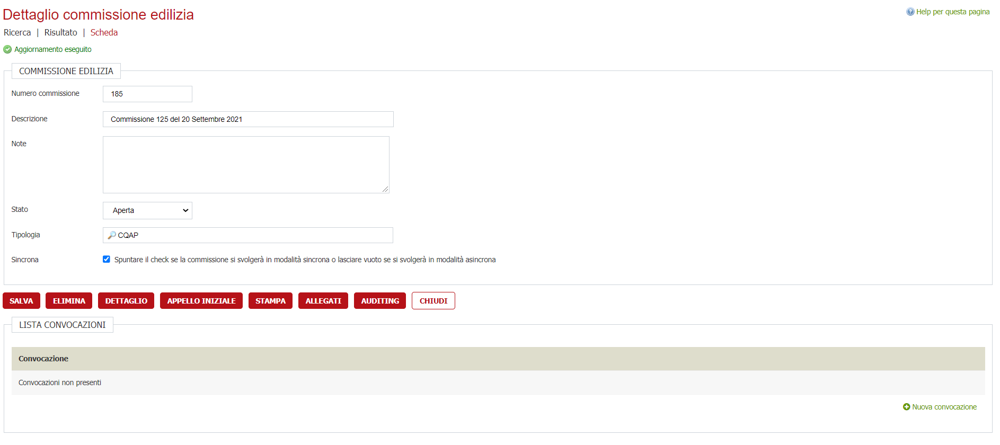

### Convocazioni

È possibile inserire/gestire le convocazioni e gli orari dalla pagina di dettaglio della comissione.

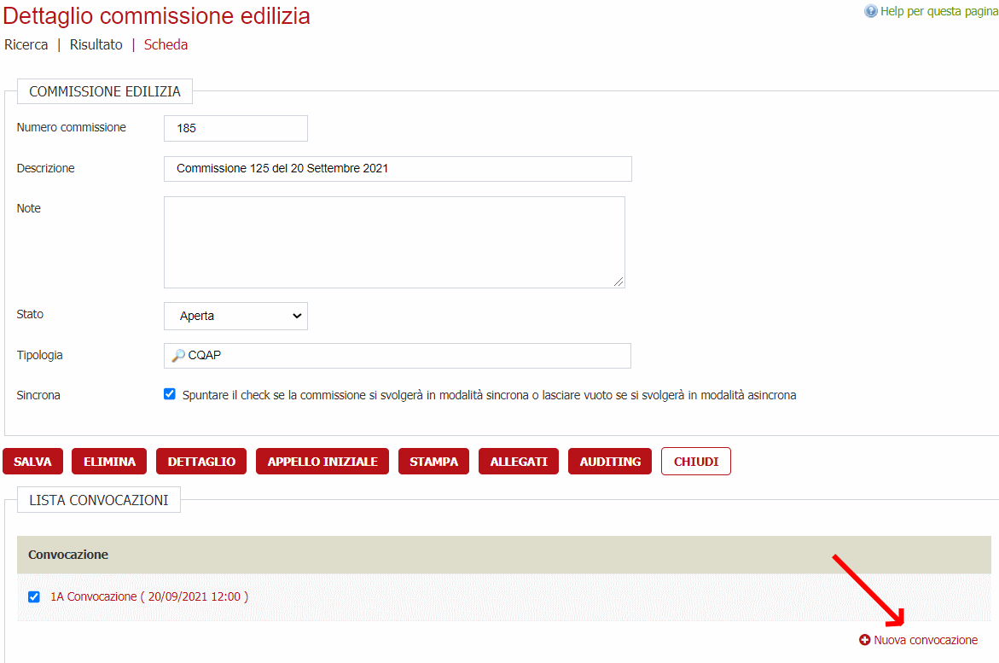

La maschera di inserimento della nuova convocazione prevede la compilazione dei campo come da immagine.
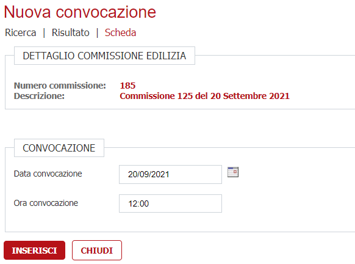

Le informazioni della convocazione sono visibili anche nella sezione delle pratiche da discutere

### Pratiche da discutere

Per ogni commissioni dovranno essere individuate delle pratiche da discutere.
Mediante il bottone **DETTAGLIO** si accede alla lista delle pratiche da discutere/inserire.

Selezionare la data di inserimento nella commissione
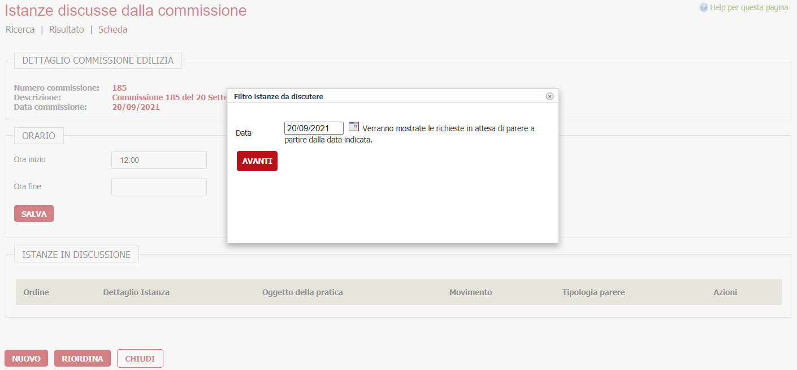

Selezionare le pratiche dalla lista dei risultati
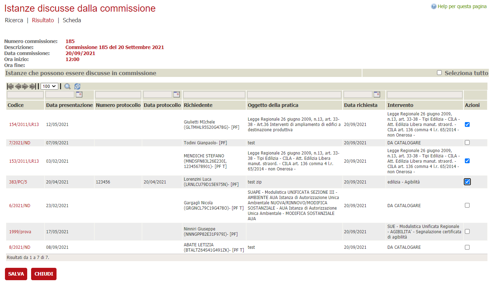

Salvare le pratiche selezionate e proseguire.
L'operatore visualizzerà le seguenti informazioni come da immagine.

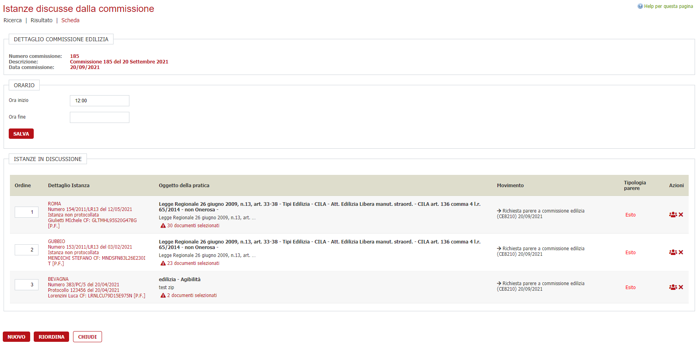

### Documenti della pratica da visualizzare

Al momento dell'inserimento di nuove pratiche vengono anche associati in  visualizzazione dell'area riservata tutti i documenti della pratica.
L'operatore ha la possibilità di eliminare dalla visualizzazione eventuali documenti che non dovranno essere visualizzati

La possibilità di farlo è data dal link presente nella schermata della lista delle pratiche in discussione.

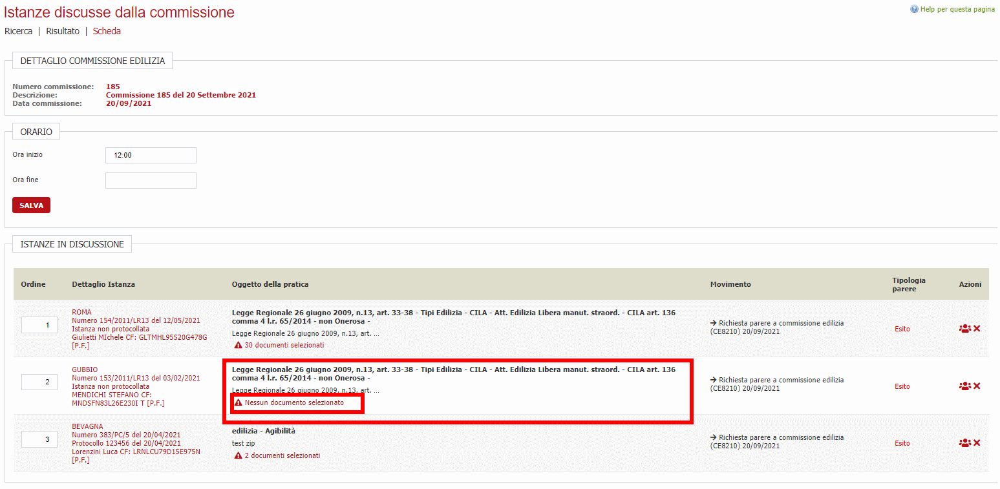

La funzionalità permette di selezionare/deselezionare i file da rendere visibili nell'area riservata

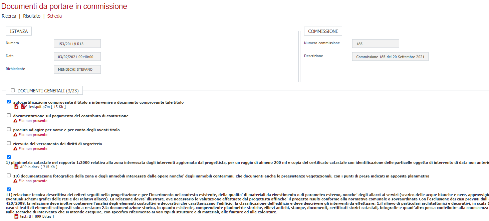

Nella lista dei file sono visualizzati anche quelli senza documento allegato per permettere all'operatore di capire se allegare / aggiungere documenti, come nel caso di integrazione, ecc....

### Appello iniziale

Una volta definite le pratiche l'operatore dovrà selezionare gli invitati alla commissione indicandone le cariche, ovvero in qualità di cosa è presente alla commissione e le pratiche di riferimento

Mediante il pulsante **NUOVO** l'operatore potrà inserire i soggetti che parteciperanno alla commissione.

Questi potranno essere:

- Interni, ovvero utenti di backoffice
- Estreni, ovvero soggetti di altre amministrazioni / associazioni esterne invitate, soggetti interessati delle pratiche in discussione

Per quello che riguarda i soggetti interni / soggetti delle amministrazioni è possibile utilizzare la maschera di inserimento come da immagine che segue

In questa maschera è possibile inserire i soggetti convocati.
Nella sezione

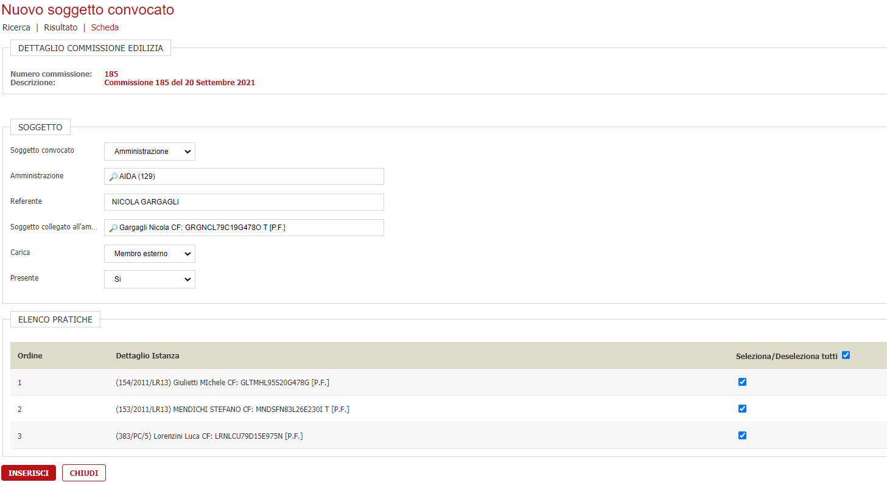

Per i soggetti delle pratiche è possibile definirli direttamente dalla  lista delle pratiche in discussione dove la procedura recupererà direttamente i soggetti di quella pratica e li assocerà con la pratica di pertinenza.

L'operatore dovrà cliccare sulla icona come da immagine

e selezionare i soggetti della pratica che parteciperanno alla commissione

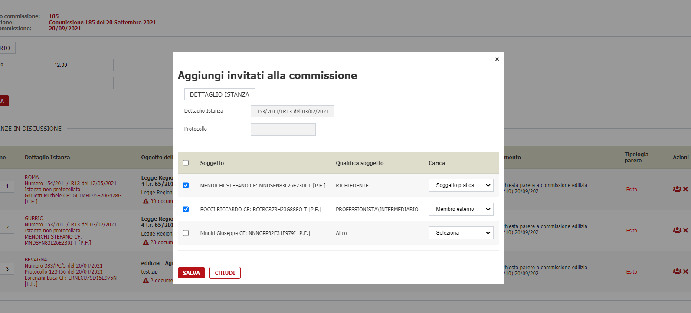

### Comunicazioni massive

La funzionalità comunicazioni massive permette di creare una serie di comunicazioni, che esitano nell'invio mail verso i soggetti convocati nell'appello.

La funzionalità è del tutto simile a quanto descritto nella [comunicazione massiva della bollettazione](../bollettazione/comunicazioni-massive.md) al netto del fatto che rispetto a quella della bollettazione non sono presenti i filtri relativi alle posizioni debitorie.

L'interfaccia di creazione di una nuova comunicazione è composta come da immagine che segue.

> 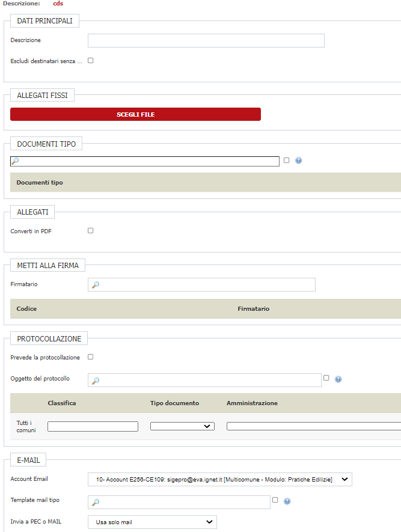

Per la creazione di allegati da documenti tipo è possibile usare gli RTF con la stampa dinamica tenendo conto del fatto che al documento vengono passati come riferimenti i parametri

- **"ID_DETTAGLIO_MASSIVA"**
- **"IDCOMUNE"**

### Stampa

La funzionalità permette di generare un documento che sarà utilizzato come verbale della commissione.

### Allegati

La sezione **ALLEGATI** conterrà gli allegati della commissione quali ad esempio il verbale.

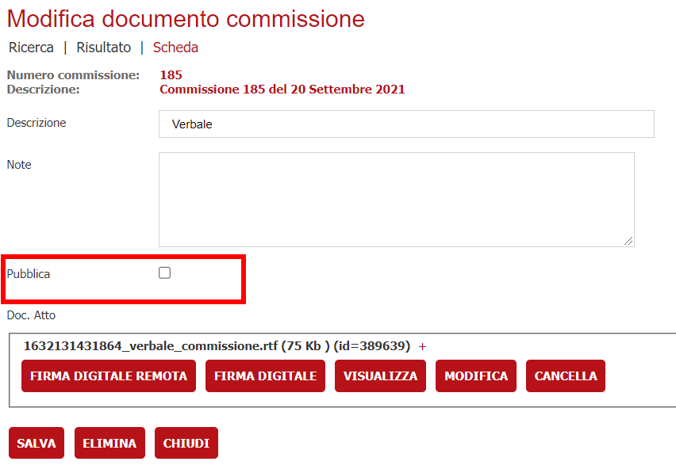

L'operatore di backoffice, che si occupa di gestire la commissione, potrà decidere mediante il flag pubblica di rendere visibile nell'area riservata il verbale.

### Auditing

In questa sezione verranno visualizzate tutte le attività registrate per la commissione quali modifiche dati, accesso ai dati, ecc...

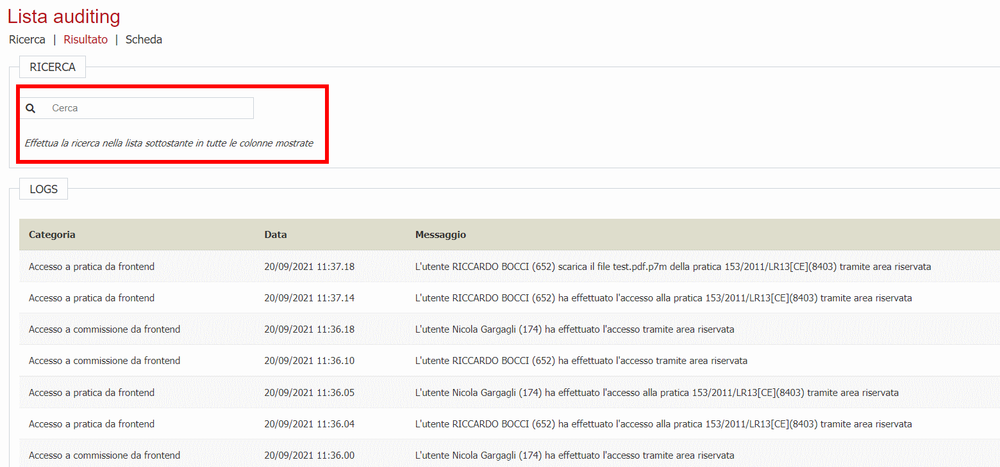

L'operatore potrà filtrare i risultati inserendo il testo di filtro nell'apposita casella di **RICERCA**

### Cancellazione

La cancellazione di una commissione verrà riportata nei logs di auditing del sistema.

## Area riservata

Per le configurazioni e spiegazioni della funzionalità nell'area riservata far riferimento alla [documentazione](../../configurazione/area-riservata/commissioni-conferenze/README.md).

