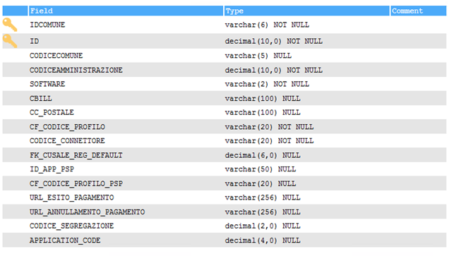
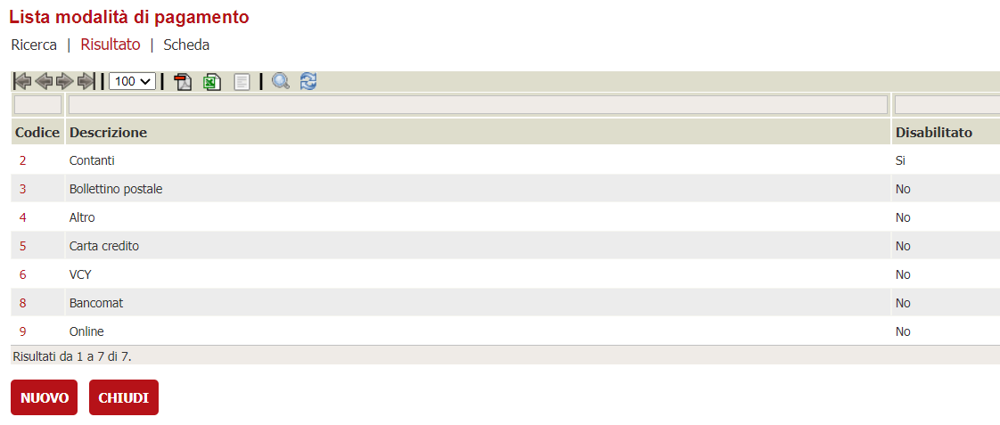

# Connettore GovPay

In questa documentazione verrà trattata la configurazione che è necessaria per attivare il connettore GovPay nel nodo pagamenti.
Per quanto riguarda l'installazione del nodo pagamenti in generale e la configurazione delle verticalizzazioni sul backoffice fare riferimento al documento  [Configurazione del nodo dei pagamenti](./configurazione-nodo-pagamenti.md)

## Servizi utilizzati dal connettore

Il connettore di GovPay implementa:

1. Caricamento della Pendenza;
2. Consultazione della Posizione Debitoria;
3. Esecuzione del pagamento;
4. Visualizzazione Esito del Pagamento.
5. Pagamento OTF
6. Invio avvisi di pagamento

## Configurazioni preliminari

L'URL web service per le varie chiamate API dovrà essere configurato in un nuovo record della tabellla _PAY_CONNECTOR_WS_ENDPOINT_. 

I valori da inserire sono i seguenti:

| Colonna | Valore | Note |
| ------ | ------ | ------ |
| **CODICE_CONNETTORE** | GOVPAY | Codice del connettore nel nodo pagamenti, si può impostare qualunque codice. Il codice deve essere valorizzato in FK nel campo PAY_PROFILI_ENTI_CREDITORI.CODICE_CONNETTORE   |
| **ID** |  | Numero progressivo |
| ENDPOINT_URL | `http://SERVER_NAME:SERVERPORT` | URL WS dell'ambiente di test |
| UTENTE | (inserire utente) | nome utente fornito |
| PASSWORD | (password)| password fornita  |
| TIMEOUT |  | Se impostato, serve a configurare il timeout di attesa nell'invocazione del servizio configurato nel campo ENDPOINT_URL |
| DESCRIZIONE | url base per le varie chiamate API | Descrizione aggiuntiva che spiega a cosa si riferisce questo endpoint |
| QUARTZ_SCHEDULE |  | Espressione chron che fa partire le chiamate ogni 10 minuti a partire dal minuto 4, ossia a e 4, a e 14, a e 24 eccetera |
| FLAG_SOLO_SCHEDULATO | 0 | Indica se la chiamata all'endpoint avviene in maniera solo schedulata (1) oppure anche sincrona (0) |
| MAX_CHIAMATE |  | lasciare vuoto |
| FLAG_SPEGNI_SCHEDULER | 0 | utile per disattivare gli scheduler mantenendo memorizzata l'espressione che lo configura in quartz_schedule |

## Configurazione del connettore

Il connettore GovPay per la regione Abruzzo è deployato già col nodo pagamenti e per poter essere utilizzato deve essere configurato inserendo un record nella tabella _PAY_CONNECTOR_CONFIG_

### PAY_CONNECTOR_CONFIG

| Colonna | Valore | Note |
| ------ | ------ | ------------ |
| **CODICE** |  | Identificativo del connettore che deve essere poi associato al profilo dell'ente creditore in PAY_PROFILI_ENTI_CREDITORI.CODICE_CONNETTORE
| DESCRIZIONE | Gov Pay | Descrizione del connettore |
| PAY_CONNECTOR_JAVA_CLASS | it.gruppoinit.pal.gp.pay.connector.govpay.GovPayConnector | Classe java che identifica il connettore |
| URL_PORTALE_PAGAMENTI | | Url per accedere al portale dei pagamenti |
| FK_WS_CARICAMENTO | | FK ai parametri di configurazione del servizio per il caricamento delle posizioni debitorie configurato al paragrafo precedente |
| FK_WS_ANNULLAMENTO | | FK ai parametri di configurazione del servizio di annullamento delle posizioni debitorie configurato al paragrafo precedente |
| FK_WS_VERIFICA | | FK ai parametri di configurazione del servizio di verifica dello stato di una posizione debitoria configurato al paragrafo precedente |
| FK_WS_ATTIVA_SESSIONE | | FK ai parametri di configurazione del servizio di attivazione di una sessione di pagamento configurato al paragrafo precedente |
|FK_WS_AVVISO||FK ai parametri di configurazione del servizio di generazione/invio dell'avviso di pagamento

È sufficente configurare un solo endpoint per tutte le chiamate

CODICE_CONNETTORE|ID|ENDPOINT_URL|UTENTE|PASSWORD|TIMEOUT|DESCRIZIONE|QUARTZ_SCHEDULE|FLAG_SOLO_SCHEDULATO|MAX_CHIAMATE|FLAG_SPEGNI_SCHEDULER
---|---|---|---|---|---|---|---|---|---|---
GOVPAY|1|https://SERVER_NAME|..in prod si usa il certificato..|....||url base per le varie chiamate API||0||0

gli altri campi devono essere lasciati vuoti

## Configurazione dell'amministrazione

Deve essere inserito un record in _AMMINISTRAZIONI_ per popolare gli attributi dell'anagrafica della Regione Abruzzo.
I campi nell'elenco sottostante, se presenti, vengono riportati nei dati (facoltativi) descritttivi dell'ente creditore durante la trasmissione delle posizioni debitorie al sistema di pagamento GovPay.

| Colonna | Descrizione |
| ------ | ------ |
| **IDCOMUNE** | Identificativo dell'installazione  |
| **CODICEAMMINISTRAZIONE** | Numero progressivo  |
| AMMINISTRAZIONE | Denominazione dell'ente |
| INDIRIZZO | Indirizzo  |
| CITTA | Località  |
| CAP | CAP  |
| PROVINCIA | Provincia  |
| TELEFONO1 | Numero di telefono  |
| EMAIL | Email  |

### pay_connector_config_params


| Colonna | Descrizione |
| ------ | ------ |
| **CONFIG_PARAM** | Nome del parametro |
| DESCRIZIONE | Descrizione del parametro |
| CODICE_CONNETTORE | Riferimento al connettore per cui e' prevista la valorizzazione del parametro, se lasciato vuoto il parametro esiste per tutti i connettori |

### pay_connector_config_values


| Colonna | Descrizione |
| ------ | ------ |
| **IDCOMUNE** | Identificativo dell'installazione |
| **ID** | Numero progressivo |
| CONFIG_PARAM | Nome del parametro |
| CODICE_CONNETTORE | Identificativo del connettore |
| VALORE | Valore che assume per la specifica configurazione dell'ente |

Da popolare con i seguenti valori:

IDCOMUNE|ID|CONFIG_PARAM|CODICE_CONNETTORE|VALORE
---|---|---|---|---
IDCOMUNE|PROGRESSIVO|SSL_TRUST_STORE_LOCATION|GOVPAY|c:/temp/arit/pae-gp-test4_truststore.jks
IDCOMUNE|PROGRESSIVO|SSL_TRUST_STORE_PASSWORD|GOVPAY|...
IDCOMUNE|PROGRESSIVO|SSL_KEY_STORE_LOCATION|GOVPAY|c:/temp/arit/pae-gp-test4.jks
IDCOMUNE|PROGRESSIVO|SSL_KEY_STORE_PASSWORD|GOVPAY|...
IDCOMUNE|PROGRESSIVO|SSL_KEY_STORE_CERT_ALIAS|GOVPAY|1
IDCOMUNE|PROGRESSIVO|GOV_PAY_URL_API_PENDENZE|GOVPAY|/govway/in/RegioneAbruzzo/GovPay-Pendenze/v2/pendenze
IDCOMUNE|PROGRESSIVO|GOV_PAY_URL_API_PROFILO|GOVPAY|/govway/in/RegioneAbruzzo/GovPay-Pendenze/v2
IDCOMUNE|PROGRESSIVO|GOV_PAY_URL_API_PAGAMENTI|GOVPAY|/govway/in/RegioneAbruzzo/GovPay-Pagamenti/v2/pagamenti
IDCOMUNE|PROGRESSIVO|GOV_PAY_BASE_URL_PATCH_OPS|GOVPAY|`https://govway-patch-dev.regione.abruzzo.it`
IDCOMUNE|PROGRESSIVO|URL_CALLBACK_CAMBIO_STATO|GOVPAY|`http://10.10.45.64:8080/api-backend/services/rest-auth-token/nodo-pagamenti/posizione-debitoria/aggiorna-stato`
IDCOMUNE|PROGRESSIVO|SECURITY_ALIAS|GOVPAY|E256
IDCOMUNE|PROGRESSIVO|SECURITY_URL|GOVPAY|`http://devel9:8080/ibcsecurity/services/sigeproSecurity.wsdl`
IDCOMUNE|PROGRESSIVO|SECURITY_USER|GOVPAY|NODO_PAGAMENTI
IDCOMUNE|PROGRESSIVO|SECURITY_PWD|GOVPAY|.....

### pay_registrazioni_causali


| Colonna | Descrizione |
| ------ | ------ |
| **ID** | Numero progressivo |
| **IDCOMUNE** | Identificativo dell'ente |
| SOFTWARE | Identificativo del modulo dell'ente |
| DESCRIZIONE | Descrizione della causale |
| ORDINE |  |
| FLAG_RIDUZIONE | |
| FLAG_NOINCASSI | |
| CODICE_VERSAMENTO | Codice che identifica l'onere nel sistema dei pagamenti dell'ente |

ad esempio

ID|IDCOMUNE|SOFTWARE|DESCRIZIONE|ORDINE|CODICE_VERSAMENTO|PARAMETRI
---|---|---|---|---|---|---
progressivo|idcomune|TT|Ticket ASL|1|ASL_TICKET|

**ASL_TICKET** è l'identificativo dellapendenza configurata in GOV pay per l'ente

### pay_regcausali_parametri

Per ogni causale è possibile specificare un **idUnitaOperativa** che viene passata durante il caricamento della pendenza.
Questo identificativo è usato ad esempio nel caso del genio civile regione abruzzo dove le configurazioni sono divise per competenza su quattro enti differenti ognuno dei quali ha una serie di comuni da gestire.
In questo caso è possibile configurare questo parametro per indicare anche questo parametro della pendenza.
**Attenzione!!** Il valore viene assegnato dal fornitere GOVPAY e nelle configurazioni va messo quello.

Es.
IDCOMUNE|ID|FK_PAYREGCAUSALE_ID|CHIAVE|valore
---|---|---|---|---
idcomune|progressivo|__codicecausaleriferimento__|**ID_UNITA_OPERATIVA**|valore assegnato in fase di configurazione da GOVPAY|

```java
    @XmlElement(name = "idDominio")
    private String idDominio = null;
    @XmlElement(name = "idUnitaOperativa")
    private String idUnitaOperativa = null;
```

### pay_profili_enti_creditori



| Colonna | Descrizione |
| ------ | ------ |
| **IDCOMUNE** | Identificativo dell'ente |
| **ID** | Numero progressivo |
| CODICECOMUNE | Codice Belfiore che identifica il comune |
| CODICEAMMINISTRAZIONE | Fk verso la tabella AMMINISTRAZIONI che identifica i dati dell'ente |
| SOFTWARE | Identificativo del modulo dell'ente |
| CBILL |  |
| CC_POSTALE | Conto Corrente Postale |
| CF_CODICE_PROFILO | E' il codice che il backoffice trasmette per identificare il sistema dei pagamenti da utilizzare |
| CODICE_CONNETTORE | Identificativo del connettore |
| FK_CUSALE_REG_DEFAULT | FK verso pay_registrazioni_causali |
| ID_APP_PSP | l'identificativo che viene passato come ida2a|
| CF_CODICE_PROFILO_PSP | Il codice fiscale dell'ente/piva  |
| URL_ESITO_PAGAMENTO | Url da richiamare per sapere l'esito di un pagamento |
| URL_ANNULLAMENTO_PAGAMENTO | Url assoluto che gestisce il ritorno all'app chiamante dopo l'annullamento del pagamento online |
| CODICE_SEGREGAZIONE | Identificativo numerico del punto di emissione degli iuv di un ente creditore |
| APPLICATION_CODE | Identificativo numerico dell'archivo di pagamenti associato a questo servizio dell'ente creditore in pagopa, utilizzato per la generazione del codice avviso con aux digit = 0 |
|CF_ENTE_QRCODE_PAGOPA|Il codice fiscale/partitaiva dell'ente che serve per generare la sezione Identificativo Ente/codice fiscale dell'Ente Creditore dell'algoritmo di generazione qrcode|

Ad esempio:
IDCOMUNE|ID|CODICECOMUNE|CODICEAMMINISTRAZIONE|SOFTWARE|CBILL|CC_POSTALE|CF_CODICE_PROFILO|CODICE_CONNETTORE|FK_CUSALE_REG_DEFAULT|ID_APP_PSP|CF_CODICE_PROFILO_PSP|URL_ESITO_PAGAMENTO|URL_ANNULLAMENTO_PAGAMENTO|CODICE_SEGREGAZIONE|APPLICATION_CODE|CF_ENTE_QRCODE_PAGOPA
---|---|---|---|---|---|---|---|---|---|---|---|---|---|---|---|---
IDCOMUNE|PROGRESSSIVO||1|TT|||G482_GOVPAY|GOVPAY|1|PAEVOLUTION|02307130696|`http://devel3.init.gruppoinit.it/nodo-pagamenti/esitoSessionePagamento/g482_govpay?stato=1`|`http://devel3.init.gruppoinit.it/nodo-pagamenti/esitoSessionePagamento/g482_govpay?stato=0`|||00193460680

# Configurazione del backend/console

Ora che il nodo-pagamenti e il connettore sono configurati, bisogna indicare al backend che è attivo un sistema per poter pagare in maniera integrata. Per fare ciò bisogna recarsi nella voce di menù del backend _**Configurazione**_ -> _**Tutti i backoffice**_ -> _**Configurazione regole**_  


attivare la verticalizzazione NODO_PAGAMENTI


e configurare i seguenti parametri personalizzandoli a seconda dell'ente


| Parametro | Valore |
| ------ | ------ |
| AR_COD_FISC_ENTE_CREDITORE | G482_GOVPAY |

# Tipicausali oneri


# Tipi modalità pagamento



# creazione del certificato di autenticazione

Quello che segue è la procedura per generare il jks per il certificato client

### esportazione in pfx dei certificati forniti

```bash
[root@sporvic3app01 prod]# openssl pkcs12 -export -in pae-gp-prod4.cer -inkey pae-gp-prod.key -out pae-gp-prod4.pfx
Enter Export Password:
Verifying - Enter Export Password:
```

### creazione del certificato client

```bash
[root@sporvic3app01 prod]# keytool -importkeystore -srckeystore /root/certs/arit/prod/pae-gp-prod4.pfx -srcstoretype pkcs12 -destkeystore /root/certs/arit/prod/pae-gp-prod4.jks -deststoretype JKS
```

### nome dell'alias creato

```bash
[root@sporvic3app01 prod]# keytool -list -v -keystore /root/certs/arit/prod/pae-gp-prod4.jks
Immettere la password del keystore:

Tipo keystore: JKS
Provider keystore: SUN

Il keystore contiene 1 entry

Nome alias: 1

```

## creazione del truststore

```bash
[root@sporvic3app01 prod]# keytool -import -file pae-gp- -alias firstCA -keystore pae-gp-test4_truststore.jks

Considerare attendibile questo certificato? [no]:  si
Il certificato è stato aggiunto al keystore

```
