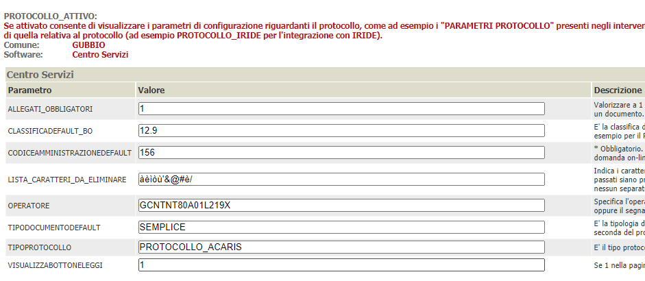
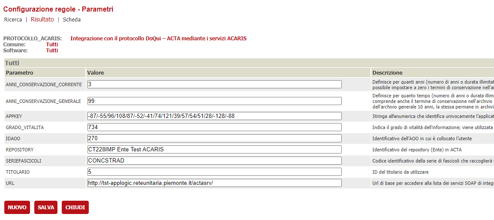
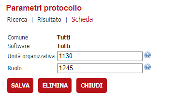
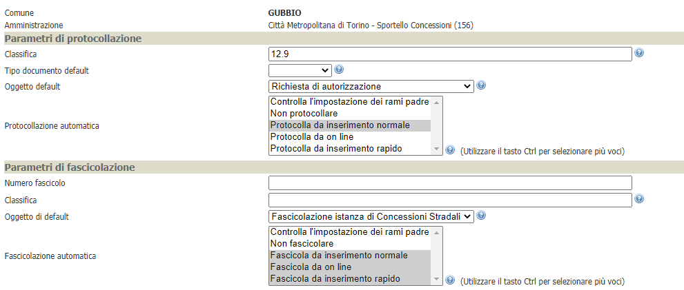

La Città Metropolitana di Torino ha implementato una serie di servizi chiamati "ACTA Archive Interoperability Services" e abbreviati in ACARIS. 
Questi fungono da proxy verso il loro sistema documentale e di protocollo che è DoQui Acta

In questa documentazione verrà trattata la configurazione che è necessaria per attivare l'integrazione con il protocollo DoQui sfruttando appunto i servizi ACARIS

# Prerequisiti

  - Backend ( VBG ) alla versione 2.81 o successiva
  - OPZIONALE: Area Riservata alla versione 2.81 o successiva

# Servizi usati dal connettore

Allo stato attuale, è possibile:
- protocollare in arrivo/partenza una pratica
- protocollare in arrivo/partenza un movimento
- lettura di un protocollo esistente
- creare un fascicolo ( o folder )
- legare un protocollo ad un fascicolo ( o folder ) presente

I servizi ACARIS mettono a disposizione altre funzionalità, che ad oggi non sono state richieste e quindi non implementate come la protocollazione interna, lo smistamento e altre funzionalità di gestione documentale

# Configurazione del connettore

## Verticalizzazione PROTOCOLLO_ATTIVO

E' necessario attivare la verticalizzazione PROTOCOLLO_ATTIVO e configurare i seguenti parametri

| Parametro | Utilizzo |
| ------ | ------ |
| **ALLEGATI_OBBLIGATORI** | Impostare a 1 in quanto il protocollo vuole comunque un documento principale. Se viene selezionato un solo documento, questo è automaticamente principale |
| **CLASSIFICAZIONE_BO** | Va recuperato insieme al cliente e indica la classificazione che contiene la serie di fascicoli in cui verranno creati tutti i folder/documenti legati alle varie protocollazioni   |
| **CODICEAMMINISTRAZIONEDEFAULT** | Utile in presenza di un solo ufficio protocollante, viene solitamente recuperata dalla configurazione dell'albero  |
| **LISTA_CARATTERI_DA_ELIMINARE** | Indicare la lista dei caratteri che devono essere eliminati dai nomi dei file inviati al protocollo. La lista ad oggi è la seguente **àèìòù'&@#è/**  |
| **OPERATORE** | Codice fiscale dell'operatore, censito nel protocollo, da utilizzare per l'autenticazione  |
| **TIPODOCUMENTODEFAULT** | Ad oggi non utilizzato, se ne consiglia la valorizzazione a SEMPLICE in quanto potrebbero sorgere modifiche che ne comportino l'utilizzo  |
| **TIPO_PROTOCOLLO** | PROTOCOLLO_ACARIS  |
| **VISUALIZZA_BOTTONE_LEGGI** | 1 in quanto la lettura dei protocolli è stata implementata  |

## Verticalizzazione PROTOCOLLO_ACARIS

E' necessario attivare la verticalizzazione PROTOCOLLO_ACARIS e configurare i seguenti parametri

| Parametro | Utilizzo |
| ------ | ------ |
| **ANNI_CONSERVAZIONE_CORRENTE** | Definisce per quanti anni (numero di anni o durata illimitata = 99)  una struttura aggregativa chiusa deve ancora rimanere in archivio corrente prima di essere trasferita in archivio di deposito. È possibile impostare a zero i termini di conservazione nell’archivio corrente  |
| **ANNI_CONSERVAZIONE_GENERALE** | Definisce per quanto tempo (numero di anni o durata illimitata = 99) una struttura aggregativa chiusa deve essere conservata in archivio generale. Il termine di conservazione nell’archivio generale comprende anche il termine di conservazione nell’archivio corrente, ovvero se una struttura aggregativa chiusa ha come termine di conservazione nell’archivio corrente 2 anni e termine di conservazione dell’archivio generale 10 anni, la stessa permane in archivio di deposito solo più per 8 anni. Non è possibile impostare a zero i termini di conservazione in archivio generale |
| **APPKEY** | Token rilasciato dal fornitore dei servizi per usufruire dei servizi in modalità di cooperazione applicativa |
| **GRADO_VITALITA** | Rilasciato dal fornitore (lo si sceglie da un elenco dei gradi di vitalità definiti per ogni Ente) |
| **IDAOO** | Identificativo della AOO |
| **REPOSITORY** | Nome del repository che viene utilizzato per ricavare una serie di identificativi utilizzati in tutte le chiamate |
| **SERIEFASCICOLI** | Codice della "serie di fascicoli" nei quali verranno creati tutti i fascicoli/folder. Viene utilizzato se non configurato diversamente sull'albero degli interventi |
| **TITOLARIO** | Codice identificativo del Titolario, rilasciato dal fornitore |
| **URL** | Url dei servizi Acaris |

## Amministrazioni

Nelle amministrazioni che verrano utilizzate come mittenti/destinatari della protocollazione vanno configurati i parametri di protocollazione tramite il bottone **PARAMETRI PROTOCOLLO** indicando nel campo Unità Organizzativa il Codice Struttura e nel campo Ruolo il Codice Nodo. Questi codici devono essere richiesti al fornitore del protocollo

Nell'integrazione con Città Metropolitana di Torino sono attualmente previste 2 amministrazioni ( ma potrebbero sorgerne ulteriori in fase di utilizzo) così configurate
| Amministrazione | Codice Struttura | Codice Nodo |
| ------ | ------ | ------ |
| Città Metropolitana di Torino - Sportello Concessioni | 1130 | 1245 |
| Città Metropolitana di Torino - Traffico e Mezzi Pubblicitari | 1130 | 1246 |

## Tipi di documento

Va configurata, da database, la tabella PROTOCOLLO_TIPIDOCUMENTO indicando:

| Parametro | Valore |
| ------ | ------ |
| **IDCOMUNE** | Identificativo dell'installazione di VBG. Per Torino COSAP utilizzare OSPCSI |
| **CODICE** | Identificativo del tipodocumento da passare al ssitema di protocollo. Per Torino COSAP utilizzare SEMPLICE |
| **DESCRIZIONE** | Descrizione che compare nella tendina di scelta in fase di protocollazione manuale. E' indifferente cosa scrivere |
| **CODICECOMUNE** | Se Null varrà per tutti gli eventuali comuni associati; altrimenti specificare il codice catastale del comune associato. Per Torino COSAP è indifferente se Null o L219 |
| **SOFTWARE** | Impostando a TT varrà èer tutti i moduli attivi in VBG altrimenti indicare il codice del modulo utilizzato |
| **ID** | Progressivo numerico in base a IDCOMUNE. Non viene trasmesso al sistema di protocollo ma serve come chiave primaria della tabella |

## Testi tipo

Bisogna configurare una serie di oggetti di default che verranno utilizzati come oggetto della protocollazione / fascicolazione. 
Per fare questo va creato, per ogni oggetto diverso, un testo tipo con i seguenti parametri

| Parametro | Valore |
| ------ | ------ |
| **Ambito** | Selezionare **Protocollo** dalla tendina |
| **Descrizione** | Comparirà nella ricerca per la configurazione dell'albero dei procedimenti |
| **Oggetto** | E' il testo che verrà unito ai dati della pratica o del movimento, per la sostituzione dei segnaposti, e poi inviato al sistema di protocollazione  |

Allo stato attuale, per Città Metropolitana, vanno obbligatoriamente configurati due testi tipo per l'oggetto della fascicolazione:

| Testo tipo | Oggetto |
| ------ | ------ |
| **Fascicolazione istanza Mezzi Pubblicitari** | [13] [23] [KM] |
| **Fascicolazione istanza di Concessioni Stradali** | [13] |

E una serie di testi tipo per i vari interventi in quanto l'oggetto è differente a seconda dell'intervento

## Albero degli interventi

Per le varie voci in cui si devono configurare scenari di protocollazione ( automatica, manuale, ... ) e parametri di protocollazione, bisogna procedere tramite il bottone **PARAMETRI PROTOCOLLAZIONE/FASCICOLAZIONE** presente nel dettaglio di ogni voce. Generalmente i parametri da impostare sono i seguenti:

| Parametro | Valore |
| ------ | ------ |
| **Comune** | Selezionare Torino oppure lasciare vuoto se la configurazione è valida per tutti gli eventuali comuni associati |
| **Amministrazione** | Indicare l'amministrazione da utilizzare come mittente/destinatario di default per la protocollazione |
| **Protocollo - Classifica** | Indica la voce di classificazione nella quale si trova la serie di fascicoli in cui verranno creati i fascicoli |
| **Protocollo - Tipo documento default** | Impostare il tipo documento precedentemente creato ( SEMPLICE ) |
| **Protocollo - Oggetto default** | Oggetto precedentemente configurato in mail/testi tipo |
| **Protocollo - Protocollazione automatica** | In fase di sviluppo è prevista la protocollazione manuale, ma a regime dovrà essere attivata anche la protocollazione da on line) |
| **Fascicolo - Numero fascicolo** | Valorizzare con il codice della serie di fascicoli che conterrà tutti i fascicoli creati. Se vuoto viene riletto dalla verticalizzazione |
| **Fascicolo - Classifica** | Lasciare vuoto in quanto non utilizzato |
| **Fascicolo - Oggetto di default** | Va configurato in quanto utilizzato come oggetto del fascicolo che viene creato, impostare il testo tipo precedentemente configurato a seconda dell'intervento che si sta configurando |
| **Fascicolo - Fascicolazione automatica** | Attualmente non utilizzato in quanto il protocollo viene sempre e comunque fascicolato o legato ad un fascicolo esistente |

# Scenari di protocollazione

## Protocollazione in arrivo

Si tratta di protocollazioni di istanze o movimenti di integrazione ricevute o comunque di qualsiasi atto in ingresso ricevuto dall'ente.

Vanno indicati obbligatoriamente i seguenti paramentri:
- Classifica 
- Tipo documento
- Flusso ( ARRIVO )
- Oggetto
- Mittenti ( almeno uno )
- Destinatario
- Allegati ( almeno uno )

In base alle configurazioni, le informazioni saranno proposte o meno in fase di protocollazione manuale. Un parametro non configurato, in presenza di protocollazione automatica ( on line ), genera errore e conseguente impossibilità di procedere alla protocollazione

## Protocollazione in partenza

Si tratta di protocollazione di movimenti in uscita ( rilascio autorizzazioni, richiesta integrazioni, ... )

Vanno indicati obbligatoriamente i seguenti paramentri:
- Classifica 
- Tipo documento
- Flusso ( PARTENZA )
- Oggetto
- Mittente
- Destinatari ( almeno uno )
- Allegati ( almeno uno )

## Protocollazione Interna

Attualmente non implementata in quanto non richiesta