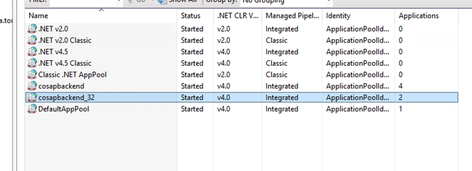
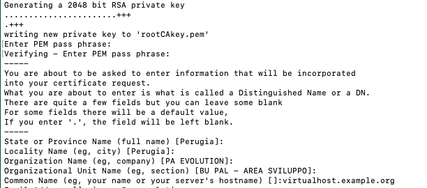

# INSTALLAZIONE SHIBBOLETH VERS. 3 SU IIS SERVER

## Preparazione server

- Attivare https sul virtual host da proteggere
- Scaricare il file di installazione di shibboleth da http://shibboleth.net/downloads/service-provider/latest/
- Eseguire l’installazione con i parametri di default
- Verificare che il servizio Shibboleth sia avviato

## Configurazione IIS

**ISAPI Filters**
- Name = Shibboleth
- Executable = C:\opt\shibboleth-sp\lib64\shibboleth\isapi_shib.dll (per sistemi a 64-bit)

**Handler Mappings**
- Path = *.sso, 
- State = Enabled
- Path Type = Unspecified
- Handler = IsapiModule
- Entry Type = Local

Nell’Application Pool utilizzato dal virtual host settare "Enable 32-bit Applications" a false

Creare un altro application pool a 32 bit per le altre applicazioni.

## Creazione dei certificati

- Creare la cartella C:\opt\shibboleth-sp\etc\shibboleth\certs
- Copiare il certificato (rootCAcert.pem) e la chiave privata (rootCAcertkey.pem) in C:\opt\shibboleth-sp\etc\shibboleth\certs 

## Configurare file shibboleth2.xml

Il site id viene recuperato con il comando

l’appicationId è composto da una parte scelta da noi, ma secondo gli standard stabiliti (in questo caso APPLICATION_TSTWEBGECONC.CITTAMETROPOLITANA.TORINO.IT_443) e da una parte che ci viene comunicata (in questo caso LIV1_WRUP).

Il Path deve essere impostato in base a ciò che deve essere protetto (inserire ibcauthenticationgateway/shibbolethlogin in modo da poter accedere anche con altre modalità, se impostato / vuol dire che è tutto protetto da shibboleth)

Il file xml del MetadataProvider ci deve essere fornito

Deve essere specificato il path dei certificati creati allo step “Creazione dei certificati” e nel tag Key inserire la password utilizzata in fase di creazione del certificato.

Nella sezione ApplicationOverride ci sono configurazioni specifiche dell’applicazione

handlerURL = “https://tst-webgeconc.cittametropolitana.torino.it/TSTWEBGECONC_LIV1_WRUP/Shibboleth.sso” **—-> url per contattare il servizio**

entityID = "IDENTITY_PROVIDER_2_PA_SECURE.RUPARPIEMONTE.IT" **--> è l'entityID dell'EntityDescriptor indicato nel file xml del MetadataProvider** 

    <Errors localLogout="localLogout_WRUP.html" redirectErrors=“https://www.spid.piemonte.it/spid/errorSPID.php"/> **-—> Pagina di logout**

Nel file di logout deve essere aggiornata questa sezione

    var logout = get['logout'];
    if(logout == ‘SPID'){
        location.replace(‘handlerUrl/Sttps://www.spid.piemonte.it/gasp_cmto/logout.do?sp=SERVICE_PROVIDER_TSTWEBGECONC.CITTAMETROPOLITANA.TORINO.IT_443_LIV1_WRUP');
    } else {
	   location.replace('https://servizi.torinofacile.it/');
    }

    <AttributeExtractor type="XML" path=“C:/opt/shibboleth-sp/etc/shibboleth/conf/attribute-map-gasp.xml"/> **-—> Questo xml ci deve essere fornito**

    <AttributeFilter type="XML" path="C:/opt/shibboleth-sp/etc/shibboleth/conf/attribute-policy-gasp.xml"/>	**-—> Questo xml ci deve essere fornito**

## Messa in COT dei metadati

Da handlerUrl/Shibboleth.sso/Metadata (nel caso dell' esempio https://tst-webgeconc.cittametropolitana.torino.it/TSTWEBGECONC_LIV1_WRUP/Shibboleth.sso/Metadata) è possibile scaricare il file dei metadata da inviare per la messa in COT.

Una volta confermata la messa in COT dei metadata è possibile testare il sistema.